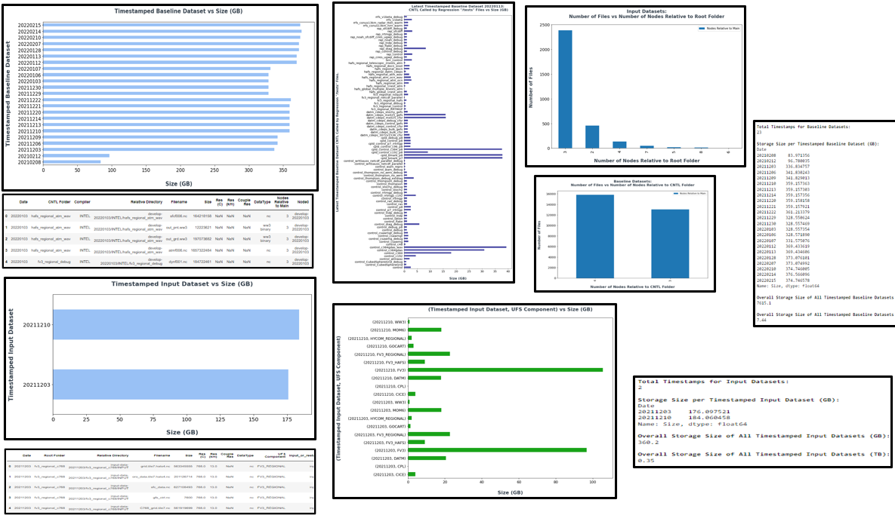

<h1 align="center">
UFS Data Analytics Tool
</h1>

    

<h5 align="center">
    
[Prerequisites](#Prerequisites) • [Dataset](#Dataset) • [Quick Start](#Quick-Start) • [Status](#Status)
 • [What's Included](#What's-Included) • [Documentation](#Documentation) • [References](#Creator(s))

</h5>

# About

__Purpose:__ 

> The purpose of the tool is to extract additional information regarding the input and baseline datasets residing within the RDHPCS -- in an effort to assist NOAA in the cleaning & restructuring of the current UFS data structure. In this demontration, the tool will be applied against the UFS input and baseline datasets residing within the RDHPC platform, Orion.

__Capabilities:__ 

The tool will be able to perform the following actions:

> Apply feature engineering to obtain additional information regarding the data files. 
  
> Extract all data filenames mapping them to their corresponding relative directory path, 
  root folder, filename, filesize, file format, compiler (if applicable), CNTL folder (if applicable),
  "input" or "restart" file type, resolution (km) category, resolution (C resolution) category. 
  
> Analyze & plot the current storage size of each UFS data file per timestamp per dataset type (input, baseline). 
  Note: At the time at which the tool is being executed, it will extract the data information from the RDHPC
  platform at that time. Thus, the data information of the datasets residing within the RDHPC will be dynamic 
  as the datasets are being cleaned.
  
> Extract number of nodes ("folders") per file to assist in categorization of the folders -- currently, node levels vary.
> Confirm no input data files are being duplicated per UFS Component's root folder and per CNTL folder.
> Categorize, sort by feature, & write restructuring data table to csv file.

__Future Capabilities:__  
> This tool can be used as a skeleton framework for acquiring additional information regarding the data analytics of future datasets of interest (e.g. SRW data, MRW data, etc).
> Construct the hierarchical trees for each unique dataset residing within a RDHPC platform.

# Table of Contents
* [Prerequisites](#Prerequisites)
* [Dataset](#Dataset)
* [Quick Start](#Quick-Start)
* [Status](#Status)
* [What's Included](#What's-Included)
* [Documentation](#Documentation)
* [References](#Creator(s))

# Prerequisites
* Python 3.9

# Dataset
* Data can be extracted from RDHPCS Orion via executing the following script(s):

> Analytics_Tool_UFS_Datasets_PI3p2_Demo.ipynb
> On Orion, user must sym link from their home directory to the main directory containing the datasets of interest.

# Quick Start
* For demonstration purposes, refer to 'Analytics_Tool_UFS_Datasets_PI3p2_Demo.ipynb'

# Status

# What's Included
Within the download, you will find the following directories and files:

> Analytics_Tool_UFS_Datasets_PI3p2_Demo.ipynb
> List of Dependencies: environement.yaml
> List of Latest Unique UFS Iput & Baseline Data Files: UFS_Data_Files_List
> 
# References
> Latest UFS Weather Model Guide:
    > https://ufs-weather-model.readthedocs.io/en/latest/InputsOutputs.html

