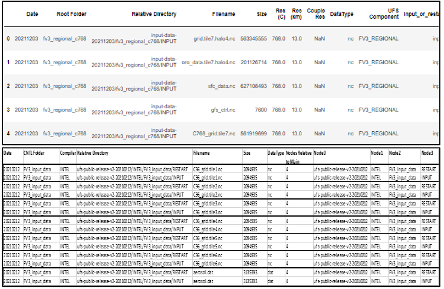

<h1 align="center">
UFS Data Analytics Tool
</h1>

    

<h5 align="center">
    
[Prerequisites](#Prerequisites) • [Dataset](#Dataset) • [Quick Start](#Quick-Start)  • [Environment Setup](#Environment-Setup) • [Status](#Status)
 • [What's Included](#What's-Included) • [Documentation](#Documentation) • [References](#Reference(s))

</h5>

# About

__Purpose:__ 

* The purpose of the tool is to extract additional information regarding the input and baseline datasets residing within the RDHPCS -- in an effort to assist NOAA in the cleaning & restructuring of the current UFS data structure. In this demontration, the tool will be applied against the UFS input and baseline datasets residing within the RDHPC platform, Orion.

__Capabilities:__ 

The tool will be able to perform the following actions:

    

    
* Apply feature engineering to obtain additional information regarding the data files. 
  
* Extract all data filenames mapping them to their corresponding relative directory path, 
  root folder, filename, filesize, file format, compiler (if applicable), CNTL folder (if applicable),
  "input" or "restart" file type, resolution (km) category, resolution (C resolution) category. 
  
* Analyze & plot the current storage size of each UFS data file per timestamp per dataset type (input, baseline). 
  Note: At the time at which the tool is being executed, it will extract the data information from the RDHPC
  platform at that time. Thus, the data information of the datasets residing within the RDHPC will be dynamic 
  as the datasets are being cleaned.
  
* Extract number of nodes ("folders") per file to assist in categorization of the folders -- currently, node levels vary.
* Confirm no input data files are being duplicated per UFS Component's root folder and per CNTL folder.
* Categorize, sort by feature, & write restructuring data table to csv file.

__Future Capabilities:__  
* This tool can be used as a skeleton framework for acquiring additional information regarding the data analytics of future datasets of interest (e.g. SRW data, MRW data, etc).
* Construct the hierarchical trees for each unique dataset residing within a RDHPC platform.

# Table of Contents
* [Prerequisites](#Prerequisites)
* [Dataset](#Dataset)
* [Quick Start](#Quick-Start)
* [Environment Setup](#Environment-Setup)
* [Status](#Status)
* [What's Included](#What's-Included)
* [Documentation](#Documentation)
* [References](#Reference(s))

# Prerequisites
* Python 3.9

# Dataset
* Data can be extracted from RDHPCS Orion via executing the following script(s):
    > Analytics_Tool_UFS_Datasets_PI3p2_Demo.ipynb
* On Orion, user must sym link from their home directory to the main directory containing the datasets of interest.

# Quick Start
* For demonstration purposes, refer to 'Analytics_Tool_UFS_Datasets_PI3p2_Demo.ipynb'

# Environment Setup:
Install miniconda on your machine. Note: Miniconda is a smaller version of Anaconda that only includes conda along with a small set of necessary and useful packages. With Miniconda, you can install only what you need, without all the extra packages that Anaconda comes packaged with:
Download latest Miniconda (e.g. 3.9 version):

wget https://repo.anaconda.com/miniconda/Miniconda3-py39_4.9.2-Linux-x86_64.sh
Check integrity downloaded file with SHA-256:

sha256sum Miniconda3-py39_4.9.2-Linux-x86_64.sh
Reference SHA256 hash in following link: https://docs.conda.io/en/latest/miniconda.html

## Install Miniconda in Linux:

bash Miniconda3-py39_4.9.2-Linux-x86_64.sh
Next, Miniconda installer will prompt where do you want to install Miniconda. Press ENTER to accept the default install location i.e. your $HOME directory. If you don't want to install in the default location, press CTRL+C to cancel the installation or mention an alternate installation directory. If you've chosen the default location, the installer will display “PREFIX=/var/home//miniconda3” and continue the installation.

For installation to take into effect, run the following command:

source ~/.bashrc
Next, you will see the prefix (base) in front of your terminal/shell prompt. Indicating the conda's base environment is activated.

Once you have conda installed on your machine, perform the following to create a conda environment:
To create a new environment (if a YAML file is not provided)

conda create -n [Name of your conda environment you wish to create]
(OR)

To ensure you are running Python 3.9:

conda create -n myenv Python=3.9
(OR)

To create a new environment from an existing YAML file (if a YAML file is provided):

conda env create -f environment.yml
*Note: A .yml file is a text file that contains a list of dependencies, which channels a list for installing dependencies for the given conda environment. For the code to utilize the dependencies, you will need to be in the directory where the environment.yml file lives.

## Activate the new environment via:
conda activate [Name of your conda environment you wish to activate]
Verify that the new environment was installed correctly via:
conda info --env
*Note:

From this point on, must activate conda environment prior to .py script(s) or jupyter notebooks execution using the following command: conda activate
To deactivate a conda environment:
conda deactivate

## Link Home Directory to Dataset Location on RDHPCS Platform
Unfortunately, there is no way to navigate to the /work/ filesystem from within the Jupyter interface. The best way to workaround is to create a symbolic link in your home folder that will take you to the /work/ filesystem. Run the following command from a linux terminal on Orion to create the link:

ln -s /work /home/[Your user account name]/work
Now, when you navigate to the /home/[Your user account name]/work directory in Jupyter, it will take you to the /work folder. Allowing you to obtain any data residing within the /work filesystem that you have permission to access from Jupyter. This same procedure will work for any filesystem available from the root directory.

*Note: On Orion, user must sym link from their home directory to the main directory containing the datasets of interest.

Open & Run Data Analytics Tool on Jupyter Notebook
Open OnDemand has a built-in file explorer and file transfer application available directly from its dashboard via ...
Login to https://orion-ood.hpc.msstate.edu/
In the Open OnDemand Interface, select Interactive Apps > Jupyter Notbook
Set the following configurations to run Jupyter:
Additonal Information
To create a .yml file, execute the following commands:

## Activate the environment to export:

conda activate myenv
Export your active environment to a new file:

conda env export > [ENVIRONMENT FILENAME].yml

# Status

# What's Included
Within the download, you will find the following directories and files:

* Data Analytics Tool:
    > Analytics_Tool_UFS_Datasets_PI3p2_Demo.ipynb
* List of Dependencies: 
    > environment.yaml
* Latest Unique UFS Input & Baseline Data Files: 
    > /UFS_Data_Files_List

# Documentation

# References
* Latest UFS Weather Model Guide:
    > https://ufs-weather-model.readthedocs.io/en/latest/InputsOutputs.html

